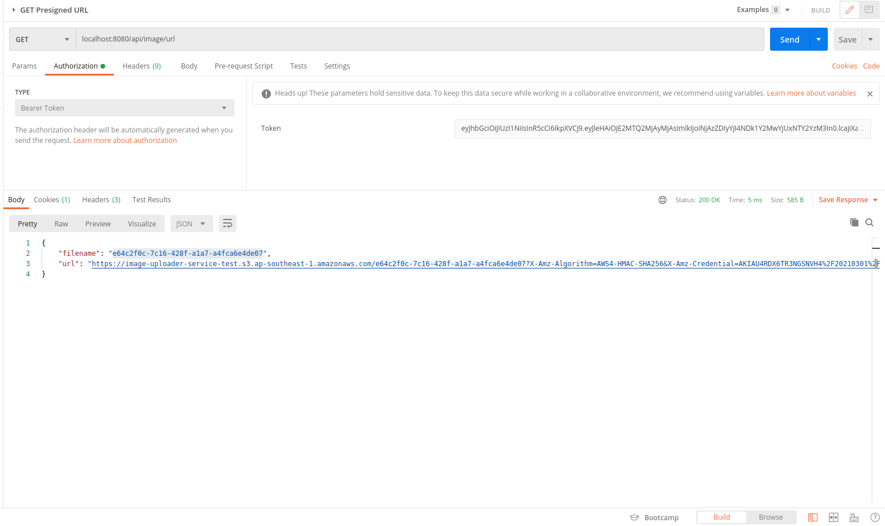
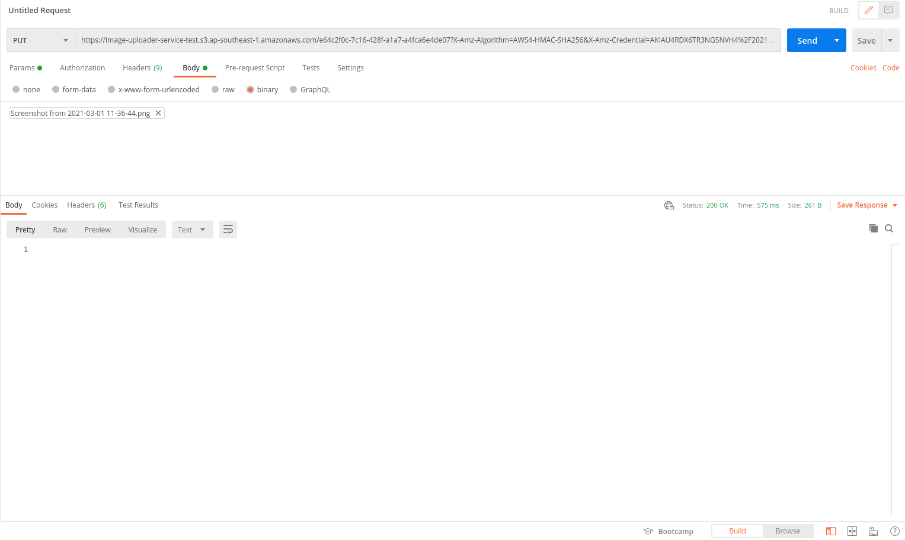
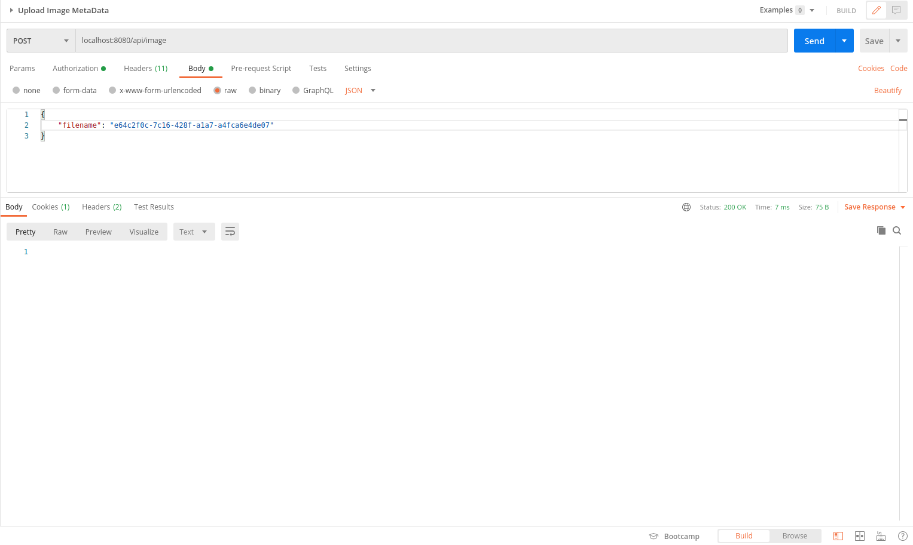
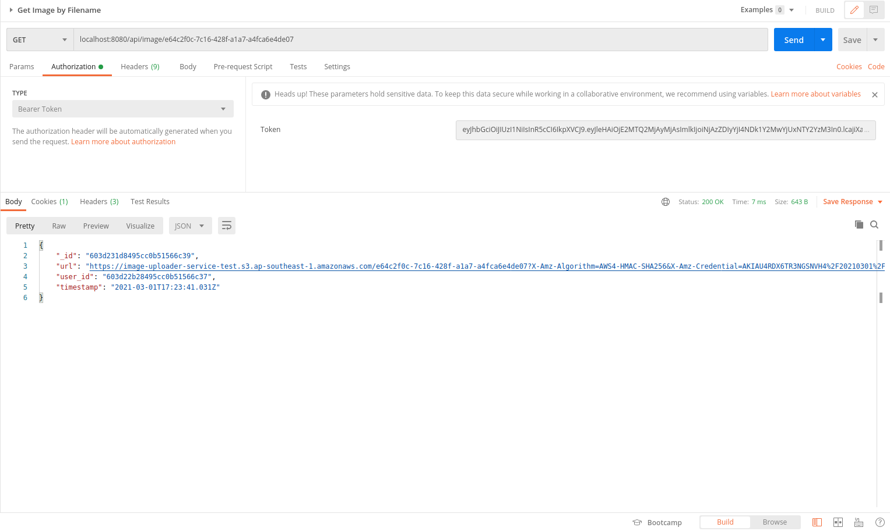
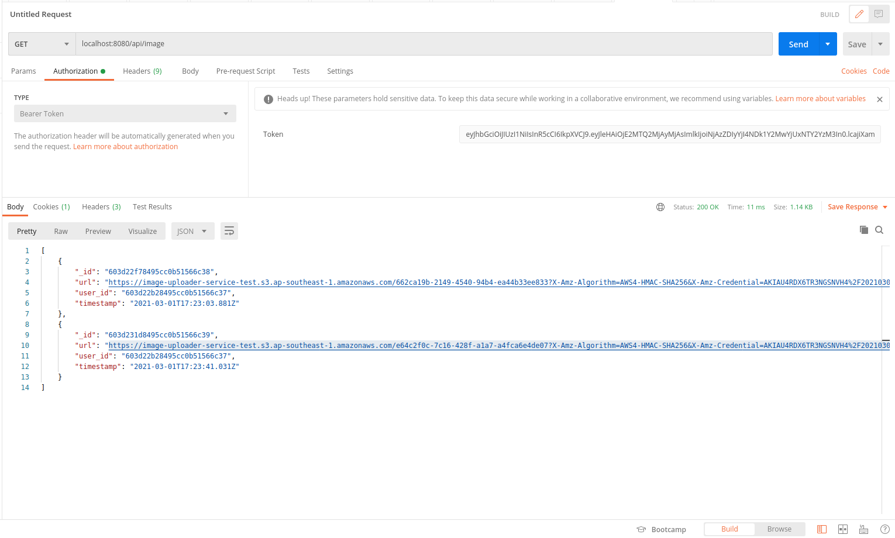

# image-uploader 

This repository is an example of how to use presigned url to create an image uploader service. This implementation will reduce the burden of the webserver since the image will be stored in cloud storage (which is more scalable and reduce the bandwidth). On the other hand, this implementation will also enable us to do the authentication and authorization before giving the url (both upload url and get url) to the user. 

## Build With

* Go
* Echo
* MongoDB
* Amazon S3

## Prerequisites

* Please create a bucket in Amazon S3 and fill the information related to the bucket and the user to the `.env` file (Use `.env.example` as guidance).
* You can check `pkg/utl/uploader/s3/s3.go` to adjust the expired time for the presigned url. 
* You also need to install `docker-compose` to run this application 

## How To Run (docker-compose)

* To run in local: 
```docker-compose run --build```

* To shutdown: 
```docker-compose down```

## Usage
After successfully running the application, you can do this:
* Create User and User Login (Use the access token on the response as bearer token for the following steps)
* Get Upload URL

* Upload image to the url

* Use filename given in the get upload url as payload for uploading image metadata

* Get Image by Filename (You can only do this if the file is uploaded by you, otherwise you will get unauthorized response)

* Get All Your Image (You will get all image you've upload)
